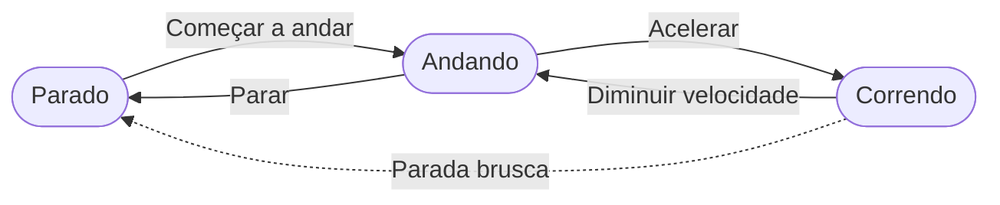
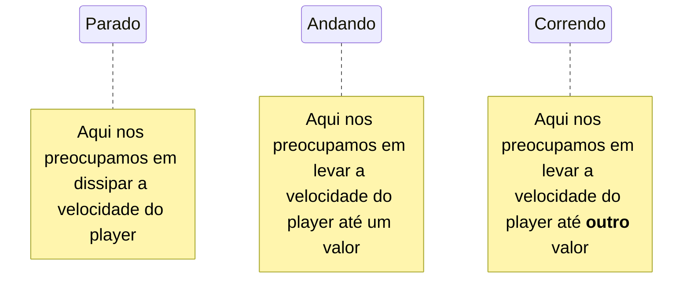
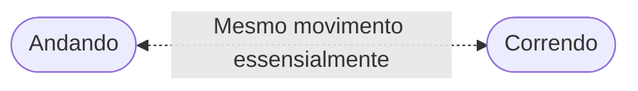
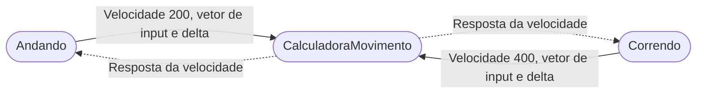

# <!--fit-->Aprofundamento em **padrões de programação**
## Aula 2
---

## Ementa da aula:
- Máquinas de estado;
- Sinais complexos;
- Signal Bus; (famosa lista encadeada)
- Singleton/Autoloads;
- O que é ser **stateless ou stateful**.
---

# Como vimos na ultima aula **todo padrão acaba indo atrás de aplicar principios gerais da programação**.

---
# <!--fit-->Citando um, os principios **S.O.L.I.D.**
* ### **Single Responsibility**: Uma classe deve ter apenas uma responsabilidade.
* ### **Open/Closed**: Entidades de software (classes, módulos, funções) devem estar abertas para extensão, mas fechadas para modificação.
* ### **Liskov Substitution**: Objetos de uma **subclasse** devem poder substituir objetos da **superclasse** sem quebrar a aplicação.
* ### **Interface Segregation**: Uma classe não deve ser forçada a implementar interfaces e métodos que não utiliza **(esse o godot não tem 100%)**.
* ### **Dependency Inversion**: Dependa de abstrações (interfaces) e não de implementações concretas **(esse tbm)**.
---
# Então agora quando formos aplicar:
- # **maquinas de estado**;
- # **componetização**; 
# Sabemos que elas servem para deixar esses **principios integros no nosso projeto**. 
# Deixando ele assim...
---
# **Manutenível**
### Suscetível de ser mantido; que mantém a posse de alguma coisa.

###### Etimologia (origem da palavra manutenível). Do latim manutenibilis / manutenere.
---
# Máquinas de estado:
* Forma diferente de pensar nas ações;
* Pensamos não no quê fazer a todo momento, mas em:
    * O que ocorre se estamos em um estado;
    * Da onde podemos ir apartir deste estado.

---

# Isso dá as máquinas de estado uma aparência facilmente representavel por **fluxogramas**.
---

### Vamos pensar então no movimento de um personagem
 
 

---

###### Agora podemos pensar nas ações dentro de cada etapa
 

---

 

### Dessa forma podemos até dizer que **andando e correndo** tem essencialmente a **mesma função de movimento**, mas com variaveis diferentes e algumas transições diferentes.

---

### Nesses casos podemos deixar **o calculo de movimento** em comum **em uma função estática** para evitarmos nos repetir e nos estados **ligar somente para as transições**.

---

# <!--fit-->Vamos ver **na prática**.

---

# Aulas e códigos **disponiveis** no github: 
## <!--fit--> https://github.com/thiago-o-dev
- (me sigam lá)
# Site buildado:
## <!--fit--> https://thiago-o-dev.github.io/courses/