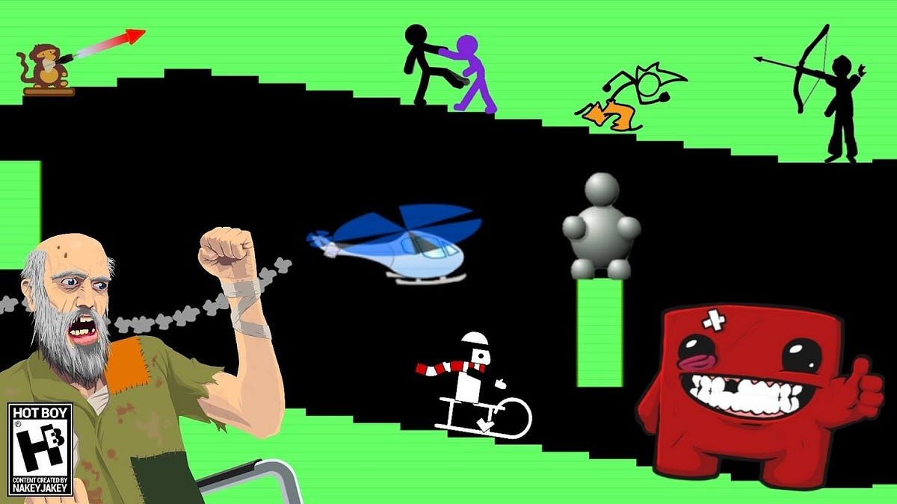
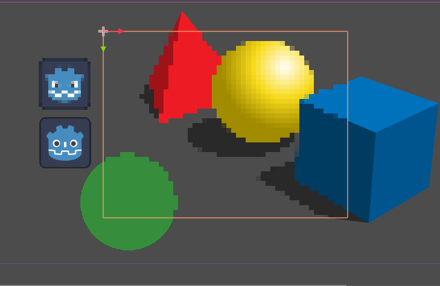

# <!--fit-->Introdução aos **efeitos visuais**
## Aula 3

---

## Ementa da aula:
- O que são tweens;
- Matemática gráfica;
- Eases e transitions;
- Formulas comuns; (bezier curves, dot product, cross product, etc)
- Aplicaçoes interessantes;
- O que sao shaders;
- Entendendo a GPU e a CPU.

---

# Da onde vem o termo **Tween**?
- ### O termo tween veio do processo de in-be**tween**ning, que é **preencher desenhos entre duas poses definidas** de uma animação.

* ### Essa nomenclatura já era usada em **1920** pelos estudios **Disney** e  **Fleischer**, sendo assim um padrão global em qualquer software hoje em dia.

* ### Pavimentam assim um **método simples** de pensar no **movimento**.

---

---
# <!--fit-->Atualmente, Tweens **são calculados digitalmente**.

### <!--fit-->Um dos exemplos mais memoráveis é a **Adobe Flash**

* ## Isso tudo que veremos é feito com **matemática e curvas de bezier**, se quiser, você pode criar **seu próprio sistema de tweens**!

---

---

### Temos as **seguintes propriedades** modificadas por tweens:
* #### **Posição** da bola 
* #### **Cor** da bola
* #### **Escala** da bola

---

# Nós controlamos o movimento **entre** essas poses por meio das:
* # **transições (transition)** e;
* # **amenizamentos (ease)**.

---

# <!--fit-->Vamos ver isso na prática dentro do **Godot**.

---

# Aulas e códigos **disponíveis** no github: 
## <!--fit--> https://github.com/thiago-o-dev
- (me sigam lá)
# Site buildado:
## <!--fit--> https://thiago-o-dev.github.io/courses/

---
# Quando vamos pensar em gráficos, estamos repletos de **funções aplicadas criativamente** como:
* ## Curvas de bezier: Para **calcularmos trajetórias** sobre o efeito de algum ponto de controle;
* ## Produto escalar (Dot Product): Calcula a **relação entre dois angulos**;
* ## Produto Vetorial (Cross Product): Produz um **novo vetor** apartir de outros dois vetores.

---

# <!--fit-->Vamos ver alguns exemplos

---

---

### <!--fit-->SHADERS
---

# Shaders alteram a tela seguindo o código, isso ocorre através da placa grafica do computador, a GPU que é **extremamente veloz**.

---

# Cada tipo de shader tem funções de processamento. 
# Hoje vamos ver um pouco sobre o **Shader CanvasItem, que é utilizado no 2D.**

---

# Ele tem as seguintes funções:
* ## **vertex()**: Roda uma vez por vertice. Manipula **forma, posição, escala de um CanvasItem** (tipo uma grama balançar no vento).
* ## **fragment()**:  Roda para cada pixel. Aplica **efeitos de cor, distorções e muito mais** (tipo colocar uma borda preta ou o efeito de onda na água)
* ## **light()**: Roda pra cada pixel afetado por luz. Te deixa mudar como esse pixel **vai responder as interações**.